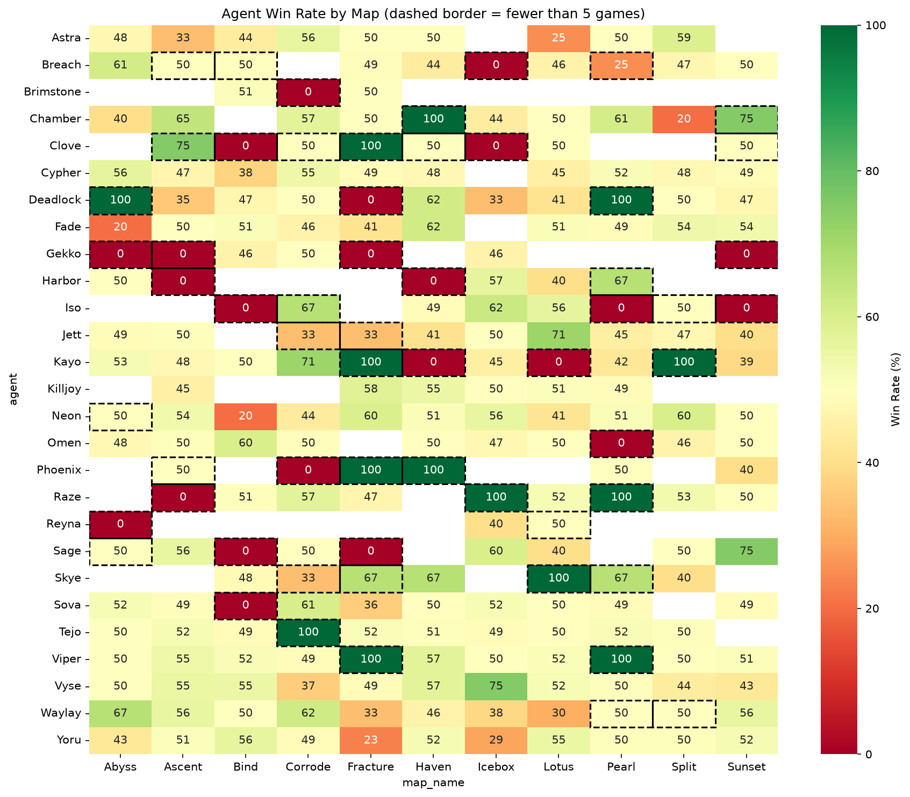
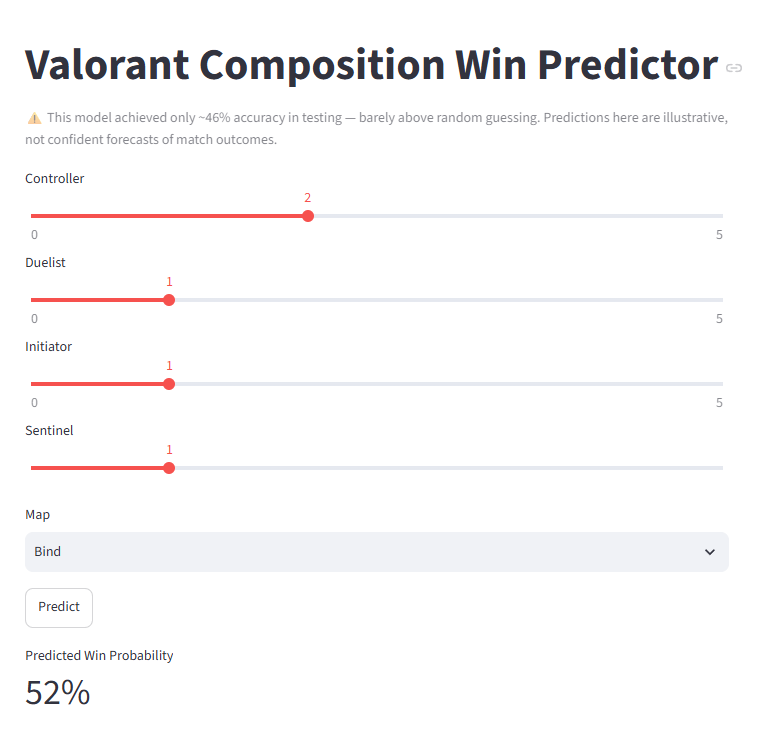

# Valorant Comp Win Predictor

An exploratory and predictive analysis of VCT 2025 match data — examining agent pick rate and win rate, and testing whether team role composition (with and without map context) can predict match win probability.

## The Question

Does team role composition predict match outcomes, and does knowing the map change that?

Specifically:
- How often is each agent picked, and how often do they win?
- Does an agent's win rate hold steady across maps, or vary significantly?
- Can win probability be predicted from a team's role composition alone?
- Does adding map as a feature improve that prediction?

## Dataset

Match, player, and agent data from VCT 2025 (Kickoff, Stage 1, Stage 2, Masters, Champions) across Americas, EMEA, Pacific, and China regions, sourced from Piyush Kumar's "Valorant 2025 - All Events" dataset on Kaggle. Data was filtered to competitive matches only (excluding showmatches and non-map-level rows), resulting in per-player-per-map records used to derive team role composition (Duelist, Initiator, Controller, Sentinel counts) for each team on each map.

## Key Findings

- **Pick rate varies far more than win rate.** Omen is picked in ~13% of instances — nearly double the next-highest agents — while win rate across almost all agents stays tightly compressed between 45-55%, regardless of how often they're picked.
- **Agent performance shifts by map, but small sample sizes distort many of the most extreme swings.** Cells with fewer than 5 games played are flagged separately, since a single game can produce a misleadingly clean 0% or 100%.
- **Team composition alone has limited predictive power.** A logistic regression model trained on role counts achieved 51.95% accuracy — barely above the 50% baseline for random guessing — with small, mixed-direction coefficients and evenly distributed prediction errors.
- **Adding map as a feature had no effect on predictions.** Accuracy remained at 51.95%, slightly above random guessing. This points to added model complexity (one-hot encoding roughly tripled the feature count) outweighing any genuine signal map context might add.
- **Taken together, composition and map explain very little of match outcome** 
  — see Limitations below for the full picture.

## Limitations

This analysis isolates two specific factors — team role composition and map — out of everything that actually determines a Valorant match's outcome. Several important caveats follow from that scope:

- **Player skill, coordination, and execution are not captured at all**, and are almost certainly the dominant factors in who wins a match. Both models' weak performance 51.95% accuracy, against a 50% baseline) is consistent with this — composition alone appears to explain very little of the outcome.
- **Some agent-map combinations have very few recorded games**, which can produce misleadingly extreme win rates (0% or 100%) from a single result. These are flagged in the heatmap rather than removed, but should be read with caution.
- **Chinese regional events have documented data gaps** in the source dataset, meaning this region is likely underrepresented relative to its actual competitive activity.
- **Map coefficients in the comp+map model are relative to a dropped baseline map**, not standalone effects — a positive coefficient means "better than baseline, holding composition constant," not "this map favors this composition in isolation."
- **Showmatches (exhibition games between mixed/non-standard rosters) were excluded**, as they don't reflect genuine competitive strategy.

## Visuals





## Interactive Predictors

Two Streamlit apps let you explore the models directly:
- `apps/app_comp_only.py` — predicts win probability from role composition alone
- `apps/app_comp_map.py` — predicts win probability from role composition and map

Both explicitly display each model's known accuracy limitations in the UI itself.

## Tools

- Python
- Jupyter
- pandas
- numpy
- matplotlib
- seaborn
- scikit-learn
- joblib
- Streamlit

## How to Run It

1. Clone the repo
2. Create and activate a virtual environment:
```
    python -m venv .venv
    ..venv\Scripts\Activate.ps1
```
3. Install dependencies:
```python -m pip install -r requirements.txt```
4. Download the [VCT 2025 Dataset](https://www.kaggle.com/datasets/piyush86kumar/valorant-vct-2025-all-events) and place event folders in `data/raw/`
5. Run the notebooks in order (`01` through `04`) to reproduce cleaning, EDA,  and both models
6. Launch either predictor from the project root:
```
    streamlit run apps/app_comp_only.py
    streamlit run apps/app_comp_map.py
```